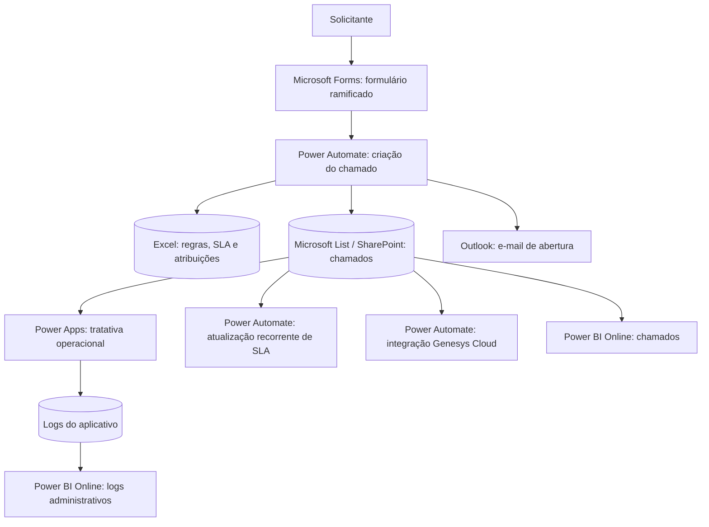
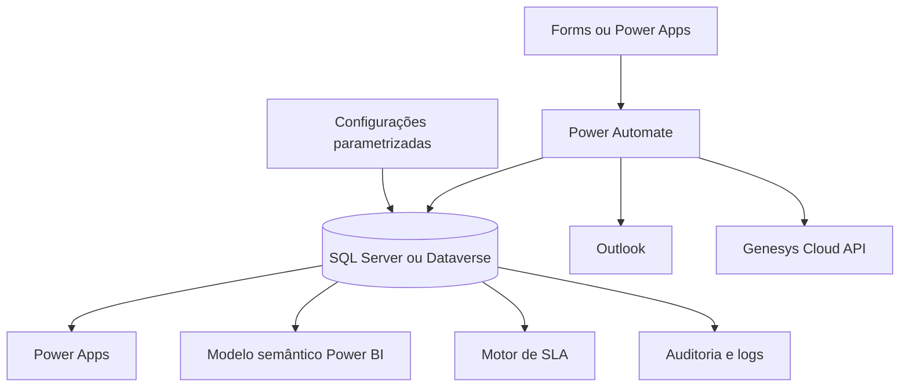

# Ops Service Hub

> Case público e anonimizado de uma plataforma integrada de solicitações, tratativa, SLA, logs e inteligência operacional.

[](#)
[](#)
[](#)
[](#)

## Visão geral

O **Ops Service Hub** demonstra uma esteira operacional ponta a ponta:

1. abertura por formulário ramificado;
2. orquestração via Power Automate;
3. cálculo de regras em base de apoio Excel;
4. armazenamento em Microsoft List/SharePoint;
5. tratativa via Power Apps;
6. atualização recorrente de SLA;
7. automações específicas para Genesys Cloud;
8. logs de acesso, pesquisa e alteração;
9. Power BI operacional e administrativo.

> Este repositório é público, anonimizado e usa somente dados sintéticos. Imagens reais devem ser revisadas e mascaradas antes de publicação.

## Demo interativa

Acesse a pasta `demo` para visualizar uma representação navegável do produto, com:

- dashboard sintético de chamados;
- jornada visual do processo atual;
- mapa de ramificações do formulário;
- timeline do Power Automate de criação;
- simulação de Microsoft List;
- mockup de Power Apps de tratativa;
- motor de SLA;
- seção de integração Genesys;
- logs e governança.

### Executar localmente

```bash
python -m http.server 8000 --directory demo
```

Depois acesse `http://localhost:8000`.

## Arquitetura atual



## Arquitetura alvo recomendada



## Estrutura do repositório

```text
├── demo/                         # Site interativo com dados sintéticos
├── docs/                         # Documentação técnica pública
├── excel-regras/                 # Desenho da base de apoio e regras
├── images/                       # Prints anonimizados e mockups
├── power-apps/                   # Documentação das telas e eventos
├── power-automate/               # Fluxos e pseudocódigo
├── power-bi/                     # Modelo analítico e medidas
├── sql/                          # Modelo relacional alvo em SQL Server
├── SECURITY.md
└── README.md
```

## O que publicar em imagens

Publique somente imagens anonimizadas em `images/screenshots-anonimizados`:

- Power Automate com nomes de conexões, URLs e e-mails ocultos;
- Microsoft List com nomes, matrículas, e-mails e dados reais mascarados;
- Power Apps com dados fictícios ou borrados;
- Power BI com dados demonstrativos;
- Excel de regras sem caminhos internos e sem informações sensíveis.

## Stack demonstrada

| Camada | Tecnologia |
|---|---|
| Entrada | Microsoft Forms |
| Orquestração | Power Automate |
| Regras de apoio | Excel |
| Armazenamento operacional | Microsoft List / SharePoint |
| Tratativa | Power Apps |
| Comunicação | Outlook |
| Integração | Genesys Cloud |
| Auditoria | Logs do app |
| Analytics | Power BI Online |
| Evolução de dados | SQL Server ou Dataverse |

## Autor

Thomas Amias Kempers Freire
