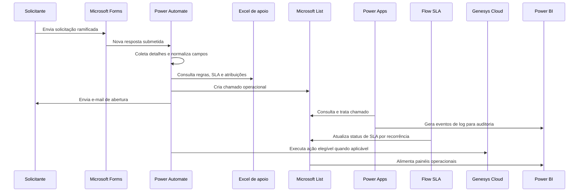

# Fluxo operacional atual

## Jornada ponta a ponta

## Responsabilidades principais

- Formulário: captura estruturada e direcionamento por ramificações.
- Power Automate de criação: normaliza, consulta regras e cria chamado.
- Excel de apoio: suporta atribuição, SLA, padrões e regras auxiliares.
- Microsoft List: repositório operacional para o app e BI.
- Power Apps: interface de tratativa, resposta e atualização.
- Power Automate de SLA: manutenção recorrente do prazo.
- Genesys Cloud: execução de processos elegíveis.
- Power BI: acompanhamento operacional e administrativo.
